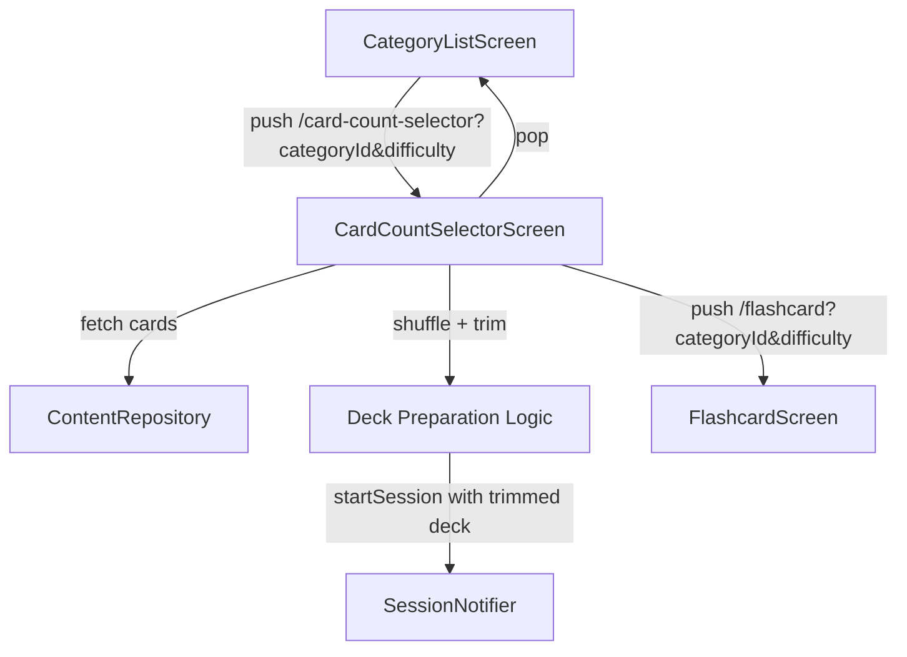

# Design Document: Session Card Count Selector

## Overview

The Session Card Count Selector introduces an intermediate screen in the navigation flow between category selection and flashcard practice. This screen lets users control session length by choosing from preset options (Quick: 5, Standard: 10, All). The selected cards are shuffled for variety, then trimmed to the chosen count before being passed to the existing `SessionNotifier` to start practice.

**Current flow:** Home → CategoryListScreen → FlashcardScreen
**New flow:** Home → CategoryListScreen → CardCountSelectorScreen → FlashcardScreen

The key change is that `CategoryListScreen` no longer directly starts a session. Instead, it navigates to the new selector screen, which handles fetching cards, shuffling, trimming, and initiating the session.

## Architecture



The architecture follows the existing patterns:
- **Router-driven navigation** via go_router with query parameters
- **Riverpod state management** for session state
- **Repository pattern** for data access via `ContentRepository`
- **Stateful widget** for the screen (consistent with `FlashcardScreen` and `CategoryListScreen`)

### Key Design Decisions

1. **Deck preparation lives in the screen widget**, not a separate provider. Rationale: the shuffle+trim logic is a one-shot operation during navigation, not ongoing state. Extracting it to a helper function keeps it testable without adding provider complexity.

2. **Modify `SessionNotifier.startSession`** to accept a pre-built list of `Flashcard` objects instead of only a `FlashcardSet`. Rationale: the trimmed deck is a subset of the full set, and the notifier shouldn't need to know about trimming logic.

3. **Keep the `FlashcardScreen` unchanged.** It already reads from `SessionNotifier` for its active deck. Since the session is started before navigation, FlashcardScreen works as-is (its current `_initialize` will detect an already-started session).

## Components and Interfaces

### New Components

#### `CardCountSelectorScreen` (StatefulWidget + ConsumerState)

**Location:** `lib/screens/card_count_selector_screen.dart`

**Props (via route params):**
- `categoryId: String` — the selected category
- `difficulty: String` — the selected difficulty level

**Responsibilities:**
- Fetch available cards from `ContentRepository`
- Display card count and preset options
- Determine button enablement based on available count
- Shuffle and trim cards on preset selection
- Start session via `SessionNotifier`
- Navigate to `FlashcardScreen`

#### `prepareDeck` (pure function)

**Location:** `lib/utils/deck_preparation.dart`

```dart
/// Shuffles the given cards and returns the first [count] cards.
/// If [count] >= cards.length, returns all cards shuffled.
/// Uses [random] for testability (dependency injection).
List<Flashcard> prepareDeck(List<Flashcard> cards, int count, {Random? random});
```

#### `PresetOption` (data class)

**Location:** `lib/models/preset_option.dart`

```dart
class PresetOption {
  final String label;      // "Quick", "Standard", "All"
  final String subtitle;   // "5 cards", "10 cards", "All cards"
  final int? cardCount;    // 5, 10, or null (meaning all)
  final bool enabled;
}
```

### Modified Components

#### `SessionNotifier`

Add an overload or modify `startSession` to accept a raw `List<Flashcard>`:

```dart
void startSessionWithDeck(Difficulty difficulty, String categoryId, List<Flashcard> cards) {
  _originalCards = List.of(cards);
  _activeDeck = List.of(_originalCards);
  state = SessionState(
    difficulty: difficulty,
    categoryId: categoryId,
    currentIndex: 0,
    elapsed: Duration.zero,
    isComplete: false,
    badCardIds: const {},
    isRetryRound: false,
  );
}
```

#### `CategoryListScreen`

Change `_onCategoryTapped` to navigate to the card count selector instead of directly to the flashcard screen:

```dart
void _onCategoryTapped(BuildContext context, WidgetRef ref, String categoryId) {
  context.push('/card-count-selector?categoryId=$categoryId&difficulty=$difficulty');
}
```

Remove the flashcard fetching logic from this screen (it moves to CardCountSelectorScreen).

#### Router (`lib/router.dart`)

Add a new route:

```dart
GoRoute(
  path: '/card-count-selector',
  pageBuilder: (context, state) => _page(
    state,
    CardCountSelectorScreen(
      categoryId: state.uri.queryParameters['categoryId'] ?? '',
      difficulty: state.uri.queryParameters['difficulty'] ?? 'easy',
    ),
  ),
),
```

### Preset Enablement Logic

```dart
bool isPresetEnabled(int availableCount, int? presetCount) {
  if (presetCount == null) return availableCount > 0; // "All" option
  return availableCount >= presetCount;
}
```

This is extracted as a pure function for testability.

## Data Models

### Existing Models (unchanged)

- `Flashcard` — `{id, text, categoryId, difficulty}`
- `FlashcardSet` — `{categoryId, difficulty, cards}`
- `Difficulty` — enum `{easy, medium, hard}`
- `SessionState` — session tracking state

### New Models

#### `PresetOption`

```dart
class PresetOption {
  final String label;
  final String subtitle;
  final int? cardCount;   // null means "all"
  
  const PresetOption({
    required this.label,
    required this.subtitle,
    this.cardCount,
  });
}

const defaultPresets = [
  PresetOption(label: 'Quick', subtitle: '5 cards', cardCount: 5),
  PresetOption(label: 'Standard', subtitle: '10 cards', cardCount: 10),
  PresetOption(label: 'All', subtitle: 'All cards', cardCount: null),
];
```

## Correctness Properties

*A property is a characteristic or behavior that should hold true across all valid executions of a system — essentially, a formal statement about what the system should do. Properties serve as the bridge between human-readable specifications and machine-verifiable correctness guarantees.*

### Property 1: Shuffle preserves deck membership

*For any* list of flashcards, shuffling the list SHALL produce a result that contains exactly the same set of card IDs as the original list (same length, same elements, possibly different order).

**Validates: Requirements 3.1**

### Property 2: Trim produces correct subset

*For any* list of flashcards and any selected count N, the trimmed deck SHALL have length `min(N, cards.length)` and every card in the trimmed deck SHALL be a member of the original list.

**Validates: Requirements 3.2, 3.3**

### Property 3: Preset enablement follows threshold rules

*For any* available card count and any preset option with threshold T (where T is 5 for Quick, 10 for Standard, 1 for All), the preset option SHALL be enabled if and only if the available count is greater than or equal to T.

**Validates: Requirements 4.1, 4.2, 4.4**

## Error Handling

| Scenario | Handling |
|----------|----------|
| Card fetch fails (network error) | Show error message with retry button. Keep user on selector screen. |
| Card fetch returns empty list | Disable all presets. Show "No cards available for this combination" message. |
| Session initiation fails | Show snackbar error. Stay on selector screen. Do not navigate. |
| Category ID missing from route | Fall back to empty string; screen will show error on fetch attempt. |
| Difficulty missing from route | Default to "easy" (consistent with existing router behavior). |

Error states follow the same patterns as `CategoryListScreen` and `FlashcardScreen`: inline error widgets with retry actions, avoiding navigation on failure.

## Testing Strategy

### Property-Based Tests

**Library:** `glados` (already in dev_dependencies)

Property-based tests target the pure logic extracted into `deck_preparation.dart` and the preset enablement function. Each test runs a minimum of 100 iterations.

| Property | Function Under Test | Generator |
|----------|-------------------|-----------|
| Property 1: Shuffle preserves membership | `prepareDeck(cards, cards.length)` | Random lists of `Flashcard` (1–100 items) |
| Property 2: Trim produces correct subset | `prepareDeck(cards, count)` | Random lists + random count (0–200) |
| Property 3: Preset enablement | `isPresetEnabled(count, threshold)` | Random counts (0–1000) × thresholds {1, 5, 10} |

Tag format: `Feature: session-card-count-selector, Property {number}: {title}`

### Unit Tests (Example-Based)

- Verify `prepareDeck` with known seed returns expected output
- Verify preset button labels and subtitles render correctly
- Verify "All" resolves to full deck length
- Verify disabled button shows available count text

### Widget Tests

- CardCountSelectorScreen renders all UI elements (prompt, buttons, count label)
- Loading state shows progress indicator + disabled buttons
- Error state shows error message + retry
- Tapping enabled preset navigates to `/flashcard`
- Tapping disabled preset does nothing
- Back button navigates to `/categories?difficulty=...`
- Zero cards shows "No cards available" message

### Integration Tests

- Full navigation flow: Category → Selector → Flashcard
- Session starts with correct trimmed deck size
- Back navigation preserves difficulty parameter
